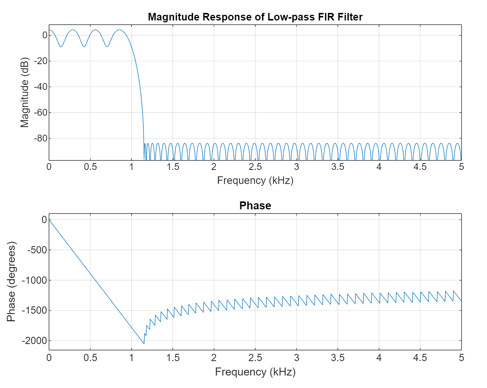
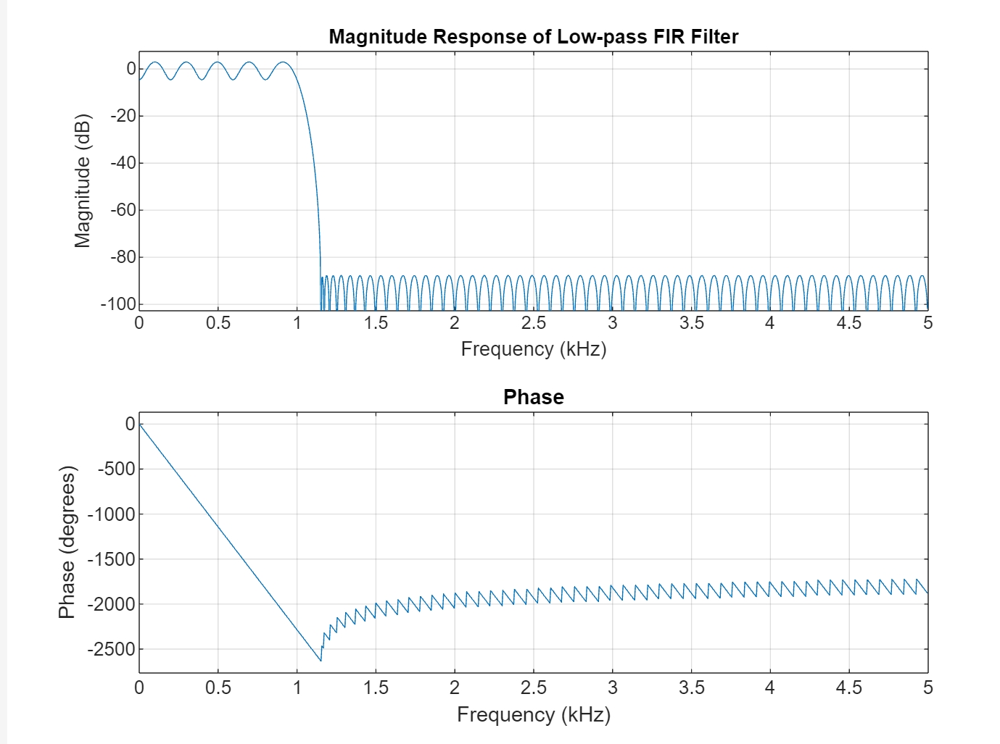
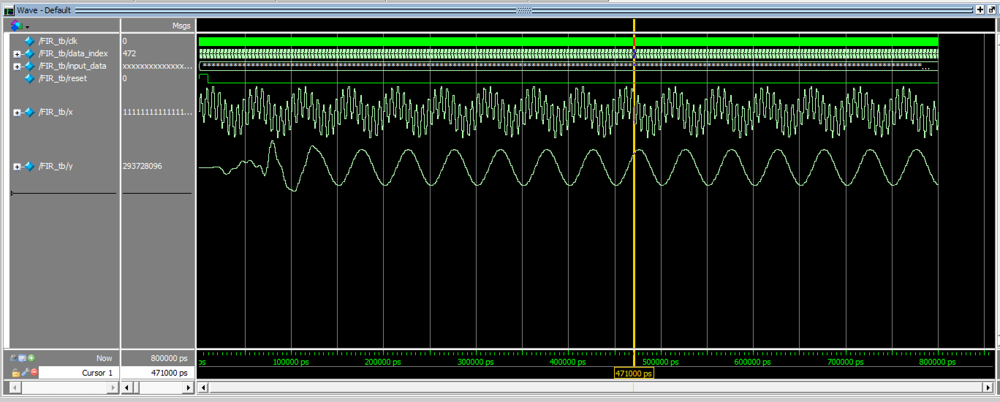
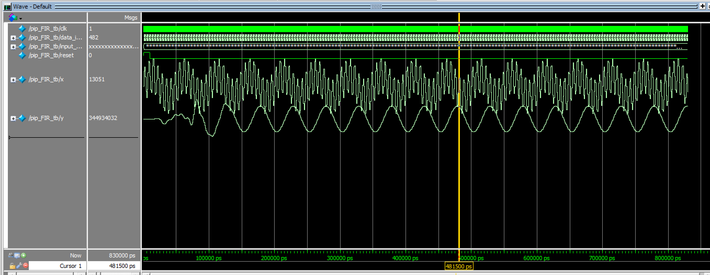

# FIR Filter Design

## Design of Parameters
The parameters for the FIR filter can be designed using MATLAB by applying the `firpminit` function. This function can be used as follows:

```matlab
b = firpm(n, ff, aa, w);
```

where:
- Adjusting `ff` modifies the passband.
- Adjusting `w` controls the ripple and stopband attenuation.

The function returns the coefficients of the FIR filter.

To generate the coefficients for a **100-tap FIR filter**, apply this function. The magnitude-frequency response for this filter at a sampling frequency of **10 kHz** is shown below:



### Improving Stopband Attenuation
The stopband attenuation is slightly lower than **80 dB**. To improve this and enhance parallelization convenience, the tap number is increased to **128**.

The updated **MATLAB-designed magnitude-frequency response** is shown below:



After design optimization:
- **Final stopband attenuation**: **80.3579 dB**
- **Passband ripple**: **4.9411 dB**

The filter coefficients (`b`) are saved in the file [`b.txt`](./b.txt).

---

## Hardware Design
Once the FIR filter coefficients (`b`) are obtained, the filter can be implemented directly in **SystemVerilog**.

### 1. Non-Pipelined FIR Filter
First, a **non-pipelined FIR filter** is implemented. The design consists of two main parts:
- **Delay Section**: Implements shift registers to store past input samples.
- **Accumulation Section**: Performs MAC (Multiply-Accumulate) operations.

The source code is available at: [`FIR.sv`](./FIR.sv).

#### Block Diagram
*(Insert block diagram image here if available)*

#### Simulation Results
The simulation waveform of the **non-pipelined FIR filter** is shown below:



### 2. Pipelined FIR Filter
Next, a **pipelined version** of the FIR filter is implemented for improved performance.

#### Simulation Results
The simulation waveform of the **pipelined FIR filter** is shown below:



---

This concludes the FIR filter design, covering MATLAB-based coefficient generation and SystemVerilog implementation for both non-pipelined and pipelined architectures.

